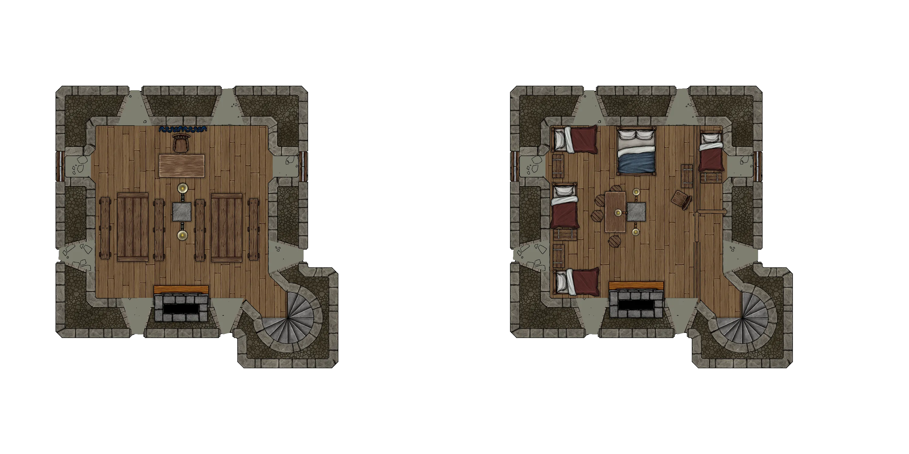

# HârnWorld Location Module: Chewintin Manor

Chewintin manor is a "Location Module" for the Foundry VTT system. It is designed to depict
the Chewintin manor in Asolade hundred, kingdom of Kaldor, on the island of Hârn in the
[HârnWorld](https://columbiagames.com/harnworld/) fantasy setting; however, this manor
could be adapted to exist anywhere in any fantasy setting.

Although designed for use with the [HârnMaster](https://foundryvtt.com/packages/hm3)
system, this module is mostly system-agnostic.  Detailed descriptions of the actors
has been provided in journal entries to facilitate conversion to other game systems.

Located in the far south-western corner of the Kingdom of Kaldor, Chewintin Manor is
ruled by a bailiff for the Earl of Balim, the powerful Troda Dariune. Isolated and badly
ruled, the current bailiff is busy making Chewintin safe from Kath raids across the Kald
River.

# Maps

The original maps from this work have been used as inspiration, and new maps have been
designed specifically to meet the requirements of the VTT environment.  The following
maps are part of this module.

## Chewintin Village

Map of Chewintin Village, including the manor.

## Chewintin Manor

Cellar and ground levels.

Second and third levels.

Roof and tower.

# Credits

This module is made possible by the hard work of HârnWorld fans,
and is provided at no cost. This work is an adaptation of the article
[Chewintin](https://www.lythia.com/harnworld/settlements/chewintin/) available at the HârnWorld
fan site [Lythia.com](https://www.lythia.com/).

**Writer:** Kerry Mould

**Original Maps:** Patrick Nilsson

**Artists:** Richard Luschek

**Adapted to Foundry VTT:** Tom Rodriguez

This module is "[Fanon](https://www.lythia.com/about/publishing-fan-written-material/)",
a derivative work of copyrighted material by Columbia Games Inc. and N. Robin Crossby.

Some assets used to create the maps in this module are from
[Forgotton Adventures](https://www.forgotten-adventures.net/).
